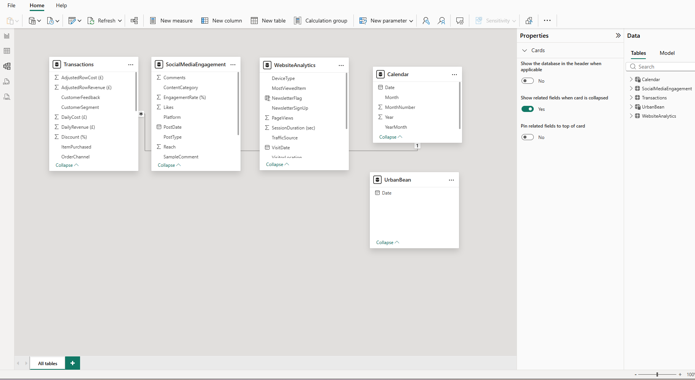
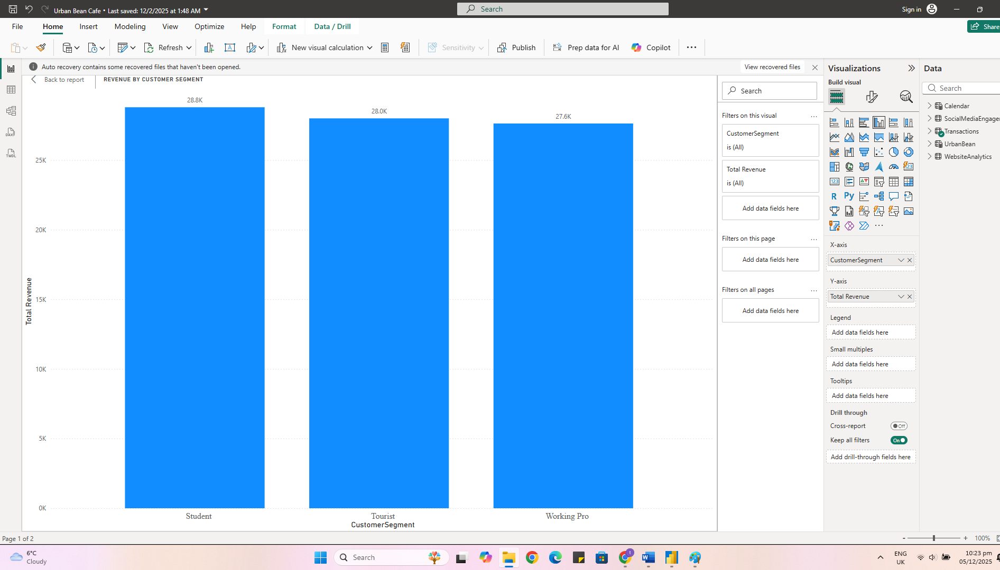

# ☕ Urban Bean Café Business Analytics

A data-driven analytics project focused on understanding sales performance, customer behaviour, and digital engagement to support smarter business decisions.

This project demonstrates how raw data can be transformed into actionable insights that improve revenue, customer experience, and overall performance in a retail environment.

---------------------------------------------------------------------------------------------------------------------------------------------------------------

## 🎯 Business Problem

Urban Bean Café needed a clearer understanding of what drives sales and customer engagement.

Key questions included:
- Which products generate the most revenue?
- Who are the most valuable customer segments?
- How effective are digital platforms in driving engagement?
  
Without these insights, decision-making was largely based on assumptions rather than data.

---------------------------------------------------------------------------------------------------------------------------------------------------------------
## 💡 Solution

To address this, I developed an interactive Power BI dashboard that brings together sales, customer, and engagement data into a single view.

This allows stakeholders to:
- Track performance in real-time  
- Identify trends and patterns  
- Make data-driven decisions with confidence
---

## 📊 Key Insights

- A small group of products contributed the majority of total revenue  
- Certain customer segments consistently drove higher sales  
- Digital engagement varied significantly across platforms  
- Some products had high visibility but low conversion, highlighting missed opportunities  

---

## 🛠 Tools & Technologies

- Power BI (dashboard development & visual analytics)  
- Excel (data cleaning & preparation)  
- DAX (measures and calculations)  
- Data Visualisation techniques  
- Business Intelligence principles  

---

## ⚙️ Project Workflow

1. **Data Collection**  
   Gathered transaction, customer, and engagement data  

2. **Data Cleaning**  
   Cleaned and structured datasets using Excel and Power BI  

3. **Data Modelling**  
   Built relationships between datasets to enable integrated analysis  

4. **Data Visualisation**  
   Designed an interactive dashboard to explore key metrics  

5. **Insight Generation**  
   Analysed trends to identify performance drivers and opportunities  

---

## 🔄 Project Workflow

1. Data Collection  
   - Gathered transaction, customer, social media and website data  

2. Data Cleaning  
   - Cleaned and transformed data using Excel and Power BI  

3. Data Modelling  
   - Built relationships across multiple datasets to enable integrated analysis  

4. Data Visualisation  
   - Developed an interactive dashboard using Power BI  

5. Insight Generation  
   - Analysed trends to identify key business opportunities and performance drivers

6. Business Insight Delivery  
   - Translated analytical findings into actionable recommendations for business improvement

----

## Data Model

The data model integrates transaction data, customer engagement, website analytics, and calendar data to enable efficient analysis across multiple business dimensions.

----

## 📊 Dashboard Preview

### Monthly Revenue Trend

Revenue shows consistent fluctuations, indicating seasonal demand patterns

---

### Top Products by Revenue

A small number of products dominate total revenue (Pareto effect)  

---

### Customer Segment Analysis

- Certain segments contribute disproportionately to sales

--- 
### Engagement by Platform

- Engagement levels differ across platforms, suggesting optimisation opportunities  

---

### Most Viewed Products

- High visibility does not always translate into high sales  

---

## 📌 Business Impact

This project demonstrates how data can be used to:

- Improve product positioning  
- Target high-value customers more effectively  
- Optimise marketing strategies  
- Support better, faster decision-making  

---

## ⚠️ Limitations

- The dataset is limited to available records and may not capture all customer behaviour  
- External factors (e.g., promotions, location, weather) were not included  
- Insights are based on historical data and may not fully predict future trends  

---

## 🚀 Recommendations

- Focus marketing efforts on top-performing customer segments  
- Improve conversion for high-visibility, low-sales products  
- Leverage high-performing platforms for targeted campaigns  
- Continuously update dashboards with new data for real-time insights  

---

## ✅ Conclusion

This project highlights the value of data-driven decision-making in a retail setting.

By turning raw data into meaningful insights, businesses like Urban Bean Café can better understand their customers, optimise performance, and drive sustainable growth.
