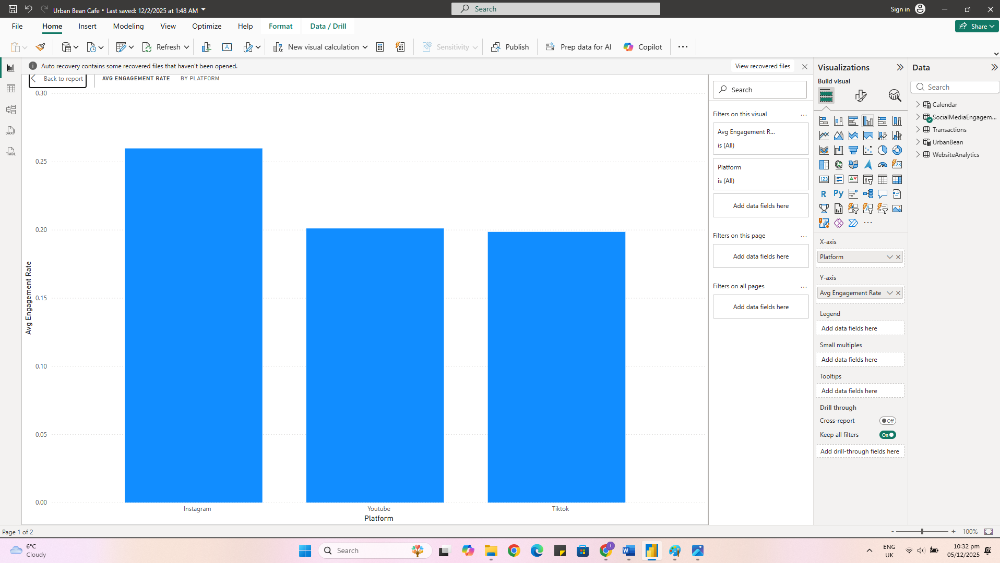

# Urban Bean Café Business Analytics

Developed a business analytics solution for Urban Bean Café to evaluate sales performance, customer behaviour and digital engagement using data visualisation and dashboard reporting.

## Project Overview
This project analyses key business metrics, including revenue trends, product performance, customer segmentation and social media engagement, to support data-driven decision-making.

## Business Problem
Urban Bean Café requires insights into sales performance and customer behaviour to improve revenue, optimise product offerings and enhance customer engagement.

## Objectives
- Increase daily footfall and in-store sales  
- Improve customer engagement across digital platforms  
- Analyse customer purchasing behaviour  
- Support data-driven marketing and product decisions  

## Tools & Technologies
- Power BI  
- Excel  
- Data Visualisation  

## Dashboard Features
- Monthly Revenue Trend  
- Top 10 Products by Revenue  
- Revenue by Customer Segment  
- Engagement Rate by Platform
- Most viewed items 

## Key Insights
- Identified top-performing products contributing to revenue growth  
- Highlighted customer segments driving the most sales  
- Revealed trends in digital engagement across platforms  
- Provided insights to support targeted marketing strategies  

## Outcome
The project provides actionable insights that can support better business decisions, improve customer experience and drive revenue growth.

## Dashboard Preview

## Dashboard Preview

### Monthly Revenue Trend

### Top Products by Revenue

### Customer Segment Analysis

### Engagement by Platform

### Most Viewed Products

